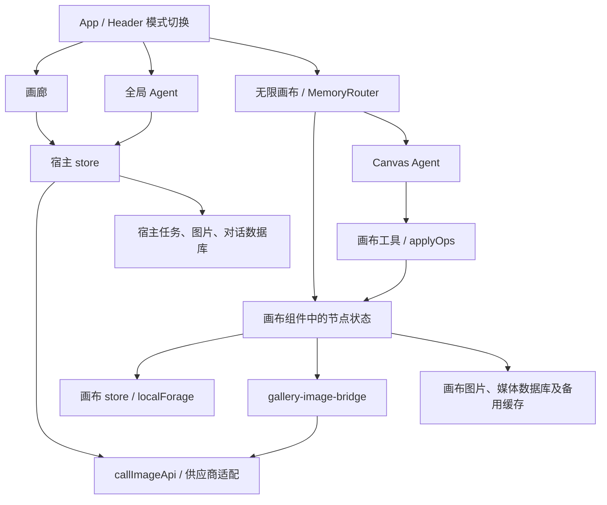

# 仓库研究与改进建议

研究日期：2026-09-08。代码基线：`4ba4d858186098153bcbf22e065d6151b1d49d02`，应用版本 `0.8.1`。

这次研究覆盖项目入口、三种工作模式、API 请求、Agent 工具执行、图片存储与回收、备份与同步、构建、测试和依赖审计。结论来自源码追踪、完整构建与测试，以及独立 Chrome 上下文中的复现。业务源码和依赖版本未修改。

当前最值得优先投入的是图片资源的完整性、画布生成任务的生命周期和跨模块请求契约。已复现 10 项功能或数据一致性问题，另有一项可量化的持久化性能问题。现有测试全部通过，适合补充覆盖这些真实边界的回归案例。

## 1. 项目结构与数据流

`src/` 下有 274 个 TypeScript/TSX 文件，其中业务文件 233 个、测试文件 41 个；物理行数合计 65,992 行，包含空行与测试。画布模块有 129 个业务文件、9 个测试文件；宿主有 104 个业务文件、32 个测试文件。这是文件分布统计，不是测试覆盖率。

| 工作流 | 主要入口 | 执行方式 | 数据归属 |
| --- | --- | --- | --- |
| 画廊 | `InputBar`、`TaskGrid`、`TaskCard`、`store.ts` | 创建 `TaskRecord`，调用统一图片 API，处理结果、错误、重试与收藏 | 宿主 Zustand、localStorage、`gpt-image-playground` IndexedDB |
| 全局 Agent | `AgentWorkspace`、`executeAgentRound`、`agentApi.ts` | Responses 对话、工具循环、批量生图、停止与恢复 | 宿主对话存储，图片仍关联 `TaskRecord` |
| 无限画布 | `InfiniteCanvasModule`、`pages/canvas/project.tsx` | 组件管理节点、连线与生成；生图通过桥接层调用宿主 API | 画布 Zustand、localForage、独立图片和媒体存储 |
| Canvas Agent | `direct-agent-panel.tsx`、`direct-agent.ts`、`use-agent-bridge.ts` | Responses 工具调用转为画布操作，再触发画布生成 | 独立 `direct:conversations:v1`，操作目标绑定画布组件上下文 |

需要掌握的几个边界：

- 宿主通过 `lockApiSettings` 固定三项 API 配置；底层还保留 OpenAI、Gemini、fal 和自定义服务商适配。阅读底层多服务商代码时，应区分它和当前界面的实际开放范围。
- 画布复用了宿主的 API 配置和请求函数，但生成结果直接进入画布存储，不创建画廊任务。因此宿主的任务恢复、透明后处理、错误记录和备份能力不会自动覆盖画布。
- 全局 Agent 与 Canvas Agent 是两套对话系统，数据格式、存储位置和工具语义不同。
- 宿主图片使用内容哈希去重和 Data URL 存储；画布图片使用随机存储键、Blob 和 Object URL。两套资源回收规则也不同。
- 主模式切换会卸载画布模块。画布内部路由使用 `MemoryRouter`，重新进入会回到画布列表。

关键文件的实际物理行数：`store.ts` 4,507 行、画布 `project.tsx` 3,061 行、`InputBar.tsx` 1,994 行、`SettingsModal.tsx` 1,780 行、`DetailModal.tsx` 1,239 行。复杂状态集中在这些文件，应围绕具体修复逐步拆分。

## 2. 已完成的验证

| 检查 | 结果 |
| --- | --- |
| `npm run build` | 通过，TypeScript 与 Vite 均成功 |
| `npm test` | 41 个文件、443 个测试全部通过 |
| 构建体积 | 主 JS 2,567.19 kB，gzip 795.97 kB；主 CSS 242.06 kB，gzip 41.33 kB |
| 构建警告 | 主包超过阈值；两处动态导入因同时存在静态导入而无法独立分包 |
| 浏览器复现 | 使用本机 Chrome、独立上下文、仅本机页面；生成 API 通过模拟响应验证 |
| 窄屏基础检查 | 390 × 844 下画布列表和新建画布可打开，未记录页面脚本异常或文档横向溢出 |
| `npm audit` | 返回 17 项依赖告警：11 high、3 moderate、3 low |

浏览器证据保存于同目录的 `repository-review-evidence-2026-09-08.json`。其中事务回滚、存储配额失败和启动时序采用明确的故障注入。未调用真实收费模型；未对真实 WebDAV 服务、Docker 容器、Safari/iOS 和长期大图库做完整验收。窄屏检查不代表所有弹窗、拖拽或触控流程均已通过。

## 3. 已复现问题

优先级定义：P1 为数据丢失或严重的数据一致性问题；P2 为特定操作失效、结果偏离设置或状态异常。优先级表示修复顺序，故障触发条件仍以每项说明为准。

### F01 · P1：Service Worker 激活会删除画布图片备用缓存

位置：`public/sw.js:13`；`src/infiniteCanvas/services/image-storage.ts:18`。

Service Worker 激活时删除所有名称不等于自身 `CACHE_NAME` 的缓存。画布在 IndexedDB 写入失败时使用的 `infinite-canvas-image-files-v1` 也会被删除。

复现：在独立浏览器中向该缓存写入图片，再注册并激活仓库的真实 `sw.js`。激活前缓存存在；激活后只剩 `meinianda-image-playground-v0.8.0`，图片无法从 Cache Storage 读取。

影响：使用备用缓存保存的图片，在 Service Worker 下一次实际激活时丢失。不是每次刷新都会触发；首次安装期间的竞态或后续 Worker 更新均值得覆盖。

建议：只删除属于应用壳的旧缓存，明确保护业务图片缓存；把缓存版本管理与发布流程衔接。回归测试必须同时放入旧应用缓存、当前应用缓存和业务图片缓存。

### F02 · P1：离开画布后，已完成生成的结果没有写回项目

位置：`src/App.tsx:91`；`src/infiniteCanvas/pages/canvas/project.tsx:417`、`:2231`。

生成完成后先 `uploadImage`，再调用组件中的 `setNodes`。项目持久化依赖该组件的 effect。切到画廊后组件已经卸载，请求仍会完成，但结果无法经该 effect 写入画布 store。

复现：启动一张图片生成，暂缓模拟接口响应，切到画廊，再返回成功图片。结果为：请求完成、图片库新增 1 张图片，项目节点仍为 `loading`，且没有图片内容关联。

影响：用户离开工作区后生成成果成为孤立资源；重新进入时还会被恢复逻辑标为“页面刷新后生成已中断”。

建议：生成完成按项目 ID、节点 ID 和本次请求标识更新画布 store，组件订阅结果。保留项目删除和任务替换校验，防止旧请求写回新状态。回归覆盖切模式、返回列表、同节点重试和运行中删除项目。

### F03 · P1：资源清理漏算生成参考图，误删仍被引用的图片

位置：`src/infiniteCanvas/services/image-storage.ts:105`；`src/infiniteCanvas/lib/canvas/canvas-node-factory.ts:38`；`src/infiniteCanvas/lib/canvas/canvas-export.ts:65`。

生成记录把参考图保存成 `metadata.references: ['image:...']`。图片回收器只识别对象的 `storageKey` 属性，忽略这种字符串引用。画布 ZIP 导出的收集逻辑也存在同类遗漏。

复现：上传图片，用生成节点的 `references` 引用它，再调用真实 `cleanupUnusedImages`。收集到的键为空，清理前 Blob 存在，清理后不存在。

影响：删除原参考图节点后，撤销历史可能暂时保住资源；历史消失后再次清理，就可能破坏已有生成节点的重试。项目备份也可能漏掉只通过 `references` 引用的媒体。

建议：统一画布媒体引用收集规则，覆盖节点、生成参考图、对话、资产和撤销历史；导出与清理复用同一规则。用“原图节点已删除，但结果节点仍需参考图重试”的案例回归。

### F04 · P1：IndexedDB 写入在事务提交前报告成功

位置：`src/lib/db.ts:38`。

`dbTransaction` 在单个 `IDBRequest.onsuccess` 就 resolve，没有等 `transaction.oncomplete`，也没有处理后续事务 abort。请求成功和事务成功是两个阶段。

复现：在真实 IndexedDB 写请求的成功事件中注入 `tx.abort()`。`putImage` 仍返回成功，随后读取不到记录。该注入验证的是事务回滚处理，不表示本次环境出现了自然磁盘故障。

影响：任务、图片或对话写入遇到事务级失败时，上层可能显示成功，实际数据未保存。

建议：暂存请求结果，在 `tx.oncomplete` resolve，在 `tx.onerror/onabort` reject。顺便统一数据库连接的复用与 `versionchange` 关闭策略；当前每次操作都会打开连接，未见相应关闭逻辑。

### F05 · P2：画布“停止生成”没有取消底层图片请求

位置：`src/infiniteCanvas/lib/gallery-image-bridge.ts:119`；`src/lib/imageApiShared.ts:21`；画布 `project.tsx:301`。

桥接函数只在调用前后检查外部 signal。共享的 `CallApiOptions` 没有 signal 字段，各供应商使用自己的超时控制器。

复现：请求发出后取消外部控制器。调用方 signal 为 aborted，实际 fetch signal 仍为 false，fetch 没收到 abort；直到接口返回后桥接层才抛 `AbortError`。

影响：界面停止后请求继续执行，最终结果被丢弃。前端应当中断传输；服务商是否同时取消生成和计费，需要其协议支持，不能由前端单方面保证。

建议：把外部 signal 贯穿统一图片 API、各适配器、结果下载和轮询，与超时取消合并，并正确释放监听器。

### F06 · P2：Gemini 图生图的部分重试路径传入 Blob URL 后直接失败

位置：`src/infiniteCanvas/lib/canvas/canvas-generation-helpers.ts:35`；画布 `project.tsx:2498`、`:2561`；`src/infiniteCanvas/lib/gallery-image-bridge.ts:129`。

`resolveMetadataReferences` 把存储键恢复成 Blob URL，桥接层随后直接把 `reference.dataUrl` 交给宿主 API。Gemini 要求此处是 Base64 Data URL。普通生成有 `hydrateNodeGenerationContext` 做转换，重试路径没有得到同样的处理。

复现：对真实桥接函数提供 Blob URL 形式的参考图，得到“Gemini 参考图必须是 Base64 data URL”，网络请求数为 0。

建议：在桥接边界统一调用已有的 `imageToDataUrl`，同时处理参考图与遮罩，避免不同调用入口各自承担转换。回归 Data URL、Blob URL、持久化存储键恢复和资源缺失四种情况。

### F07 · P2：画布“透明输出增强”开关没有接入透明后处理

位置：`src/infiniteCanvas/components/canvas/canvas-image-settings-popover.tsx:146`；`src/infiniteCanvas/lib/gallery-image-bridge.ts:125`；对照 `src/store.ts:1692`、`:1987`。

画布显示并保存 `transparent_output`，但桥接层只调用图片 API，未执行宿主任务中的辅助提示词和背景去除流程。

复现：设置 PNG、opaque、`transparent_output=true`。实际请求仍为原提示词和 opaque，返回的图片字节与模拟接口的原始图片完全相同。

建议：提取宿主现有透明处理流程供画廊与画布复用，保留原图和参数记录；修复前不应让此开关表达已具备该能力。

### F08 · P2：画布保存了生成参数快照，重试却仍受全局参数变化影响

位置：`src/infiniteCanvas/lib/gallery-image-bridge.ts:65`、`:72`；`src/infiniteCanvas/lib/canvas/canvas-node-factory.ts:52`。

写入时保存 `imageParamsSnapshot`，读取时合并的是当前全局参数、部分旧字段和增量 `imageParams`，没有读取快照。

复现：节点保存 PNG 快照后，把全局输出格式改为 JPEG。节点快照仍为 PNG，读取出的有效参数却变成 JPEG。其他未显式覆盖的参数也有相同问题。

建议：区分“新建配置继承全局默认值”和“已有生成结果按历史参数重试”。后者优先使用快照，再叠加本次明确修改；旧数据按既有兼容规则回退。

### F09 · P2：宿主初始化用旧任务快照覆盖启动期间的新任务

位置：`src/App.tsx:34`；`src/store.ts:1401`、`:1455`。

`initStore` 异步读取任务，经过对话恢复等步骤后直接 `setTasks(tasks)`。入口没有初始化 Promise 去重，画廊提交也没有等待任务加载完成。

复现：在真实任务读取的成功事件中注入一个新任务，同时将其写入数据库。初始化完成后，数据库保留新任务，但界面任务列表为空。

影响：慢存储或启动期间快速操作可能造成任务暂时消失；生产环境也存在这个时序窗口。开发环境 StrictMode 额外执行 effect 会增加重复初始化机会。

建议：初始化去重，在加载完成前明确控制提交入口，并在应用已发生写操作时合并读取结果。启动资源清理也要基于完整、最新的引用集合。补充慢读取和重复初始化测试。

### F10 · P2：画布状态回退写入 localStorage，恢复时可能读不到

位置：`src/infiniteCanvas/lib/localforage-storage.ts:10`、`:18`。

写入 IndexedDB 失败会回退到 localStorage；读取只有 IndexedDB 抛异常才回退。配额用尽往往影响写入，读取仍可能成功返回 null 或旧值。

复现：模拟 IndexedDB 写入失败、读取成功返回 null。`setItem` 在备用存储成功写入 `new-project`，随后 `getItem` 返回 null。

建议：记录权威存储位置或写入版本，读取时能识别备用存储的更新数据。只在主存储返回 null 时读备用值，仍不足以处理主存储存在旧值的情况；删除时也要处理两边的一致性。

## 4. 已确认的性能改进空间

### O01：减少无变化的持久化写入

独立浏览器中连续调用 100 次 `setSelectedTaskIds`，产生 100 次宿主 localStorage 写入，但序列化内容只有 1 种，总计重复写入 225,400 个字符。测试只使用空白账户的默认数据，真实长草稿和遮罩会扩大单次负载。

原因是宿主 persist 覆盖整个 store 的更新入口；`partialize` 过滤字段，不会自动消除本次持久化内容没有变化的写操作。

建议先比较要保存的数据，减少重复序列化和写入，再考虑把选择、弹窗、预览等瞬时状态移到现有 UI 层或独立小 store。全局 Agent 的订阅目前还会整体替换对话集合，Canvas Agent 的草稿更新也会排队保存所有历史对话；两处都适合按变化范围合并写入。

### O02：按工作区和弹窗实际使用时机分包

`App.tsx` 静态引入画廊、Agent 和画布，画布模块又静态引入完整项目编辑器。实际构建主 JS 约 2.57 MB，gzip 后约 796 kB。

建议按以下顺序拆分：画布列表与编辑器、设置中的脚本编辑器、遮罩编辑器和详情弹窗，再处理模式切换。默认进入画布列表时也不必同时下载完整编辑器。已有 Markdown 异步加载与降级逻辑应继续保留。

验收用构建产物和浏览器首屏网络请求判断；不要通过调高 chunk 警告阈值替代优化。此次未测量移动设备的真实首屏耗时，不给出未经实测的提速百分比。

### O03：给大图库与 Object URL 建立资源预算

画廊已有缩略图、原图 LRU 和图片懒加载；`TaskGrid` 仍一次渲染所有筛选结果，每张卡片挂载自己的 hooks 和订阅。大量历史下可以先做分页，再根据拖选需求考虑虚拟列表。

画布 `objectUrls` 是无容量上限的 Map，打开多个项目后，已解析的 Blob URL 会持续保留，直到对应资源被删除。`setImageBlob` 覆盖键时也未撤销旧 URL。建议明确“资源仍在数据库”和“当前视图需要 Object URL”的区别，安全释放不再被视图引用的 URL。

图库性能验收应覆盖 1,000 和 10,000 个任务、批量选择、筛选、滚动与页面切换；这些规模尚未实测。

### O04：按项目保存画布，增加可靠的保存状态

画布存储采用 400 ms 延迟保存整个 `projects` 数组，视口还叠加一层 500 ms 延迟。当前未见页面离开时的待保存处理，保存失败也缺少明确的 UI 状态。

建议先完成 F02/F10，再增加“保存中／已保存／保存失败”的真实状态，并按变化项目保存。页面隐藏时可提前触发保存；不能假定卸载阶段启动的异步 IndexedDB 操作一定有时间完成。大数据 ZIP 构建也应逐步迁移出主线程，画布当前使用同步 `zipSync/unzipSync`。

## 5. 还应安排验证的边界

下面来自明确的代码路径或数据格式检查，未计入前述 10 项浏览器／故障注入复现。

| 边界 | 发现与建议 |
| --- | --- |
| 备份范围 | 宿主 `exportData` 覆盖宿主任务和全局 Agent；画布导出覆盖项目、项目内旧 `chatSessions` 和资源。独立 Canvas Agent 的 `direct:conversations:v1` 未接入这两套导出或 `app-sync.ts`。应补齐该会话备份，并在设置中说明每个导出入口的范围。 |
| 导入数据校验 | 宿主主要验证 ZIP 中引用文件是否存在；画布把 JSON 直接断言为 `CanvasExportFile`，缺少逐项结构、有限数值、引用关系和版本兼容验证。应在修改任何现有数据前完成预检，并明确失败时如何回滚。 |
| Canvas Agent 清空选择 | 工具描述允许 `canvas_select_nodes({ ids: [] })`；桥接校验要求数组中至少存在一个非空 ID，合法的清空选择操作会被过滤。可补一个小型工具契约回归测试。 |
| Canvas Agent 读状态 | `direct-agent.ts` 的读取工具使用本轮保存的 `canvasSnapshot`，只有写操作结果会更新它。异步生成或用户手动操作后再次读取，可能仍得到旧快照。需要在生成完成后读取真实状态的端到端案例。 |
| WebDAV 删除语义 | `mergeById` 合并本地与远端项目，没有删除标记。如果将其视为双向同步，本地删除的项目可能被远端旧数据重新带回。需明确其定位是合并备份还是双向同步。 |
| WebDAV 编辑并发 | 同步读取项目快照后，等待媒体下载，再整体 `replaceProjects`；期间的本地编辑可能被旧合并结果覆盖。应在应用远端结果时重新核对最新本地版本。 |
| 旧文档与当前产品 | README 主要介绍画廊与 Agent，默认界面已经是无限画布。应补充三套数据关系、离线边界、备份范围与恢复入口。根目录许可说明与画布目录保留的上游许可也应在说明文档中准确并列。 |

## 6. 依赖、部署与扩展边界

2026-09-08 执行 `npm audit` 返回 17 项依赖告警，包含开发工具和浏览器运行时依赖。这个数字不能直接视为 17 个已证明可攻击的应用漏洞。建议以锁文件中的版本、实际运行环境和代码路径逐项处理。

最直接相关的是 Vite：本次构建使用 `6.4.2`，仓库 `vite.config.ts` 配置 `server.host: true`，工作环境为 Windows。维护者公告 GHSA-fx2h-pf6j-xcff 指出该版本存在 Windows 路径形式导致的文件拒绝规则绕过，`6.4.3` 修复了此项。影响还要求开发服务可被访问、允许目录中存在受保护文件等条件。本次只核对版本和配置，没有尝试读取敏感文件。

Axios、DOMPurify、Mermaid、React Router、nanoid 也有命中项；应区分依赖版本命中与应用具备利用前提。比如当前画布使用 `MemoryRouter`，不能据此套用 React Router 服务端模式的全部影响。可以先做受影响范围内的补丁升级，再对 API、Markdown 和路由做针对性验收。本次未执行 `npm audit fix`，未更改锁文件。

现有 GitHub Pages 工作流执行安装与构建，未见独立的 PR 测试工作流；其余部署流程也未见 `npm test`。建议加 PR 构建和测试门禁，再加入少量浏览器集成测试。

远程节点插件通过动态模块执行，模型调用脚本使用 `new Function`，属于同源代码扩展能力。API Key 又保存在当前浏览器，扩展能力和配置导入应清楚说明信任范围。这是扩展设计边界，本次未证明存在插件注入漏洞。

## 7. 推荐实施顺序与回归标准

| 批次 | 具体工作 | 验收标准 |
| --- | --- | --- |
| 1：保护数据 | F01、F03、F04；核对 Canvas Agent 备份遗漏 | Worker 更新后图片仍在；引用图不会被误删；回滚事务必须返回失败；备份可在空浏览器恢复目标数据 |
| 2：完成任务生命周期 | F02、F05 | 切工作区后结果能回到原项目；旧请求不会覆盖重试结果；取消信号实际到达请求与下载 |
| 3：统一图片输入输出 | F06、F07、F08 | 重试接受持久化参考图；透明增强实际改变处理流程；历史任务不随全局参数漂移 |
| 4：稳定恢复 | F09、F10、画布保存状态、导入预检 | 慢启动保留新任务；备用存储能恢复最新数据；保存与导入失败可以被用户理解和恢复 |
| 5：控制性能与维护成本 | O01—O04、PR 检查、依赖升级 | 瞬时 UI 更新不重复写配置；首屏按需加载；大图库与跨项目浏览有明确资源预算 |

实现时优先复用 `src/lib/` 已有图片转换、透明处理和持久化规范化逻辑。围绕上述边界拆出小模块、hook 和组件，保持主 store 为状态与 action 入口；画布执行结果应归项目 store，避免再依赖卸载组件保存。无需为本轮修复引入新的通用框架。

## 8. 参考资料与证据说明

本报告中的应用行为以本地源码和同目录 JSON 证据为准。浏览器 API 和依赖公告另核对了以下原始文档；链接放在代码格式中以便复制。

- CacheStorage 的页面与 Worker 访问范围：`https://developer.mozilla.org/en-US/docs/Web/API/CacheStorage`
- IndexedDB 事务提交事件：`https://developer.mozilla.org/en-US/docs/Web/API/IDBTransaction/complete_event`
- Fetch 取消机制：`https://developer.mozilla.org/en-US/docs/Web/API/AbortController/abort`
- React effect 生命周期与异步清理：`https://react.dev/reference/react/useEffect`
- React 按需组件加载：`https://react.dev/reference/react/lazy`
- Vite Windows 文件规则绕过：`https://github.com/advisories/GHSA-fx2h-pf6j-xcff`
- Mermaid CSS 注入及适用条件：`https://github.com/advisories/GHSA-6x64-9x62-f2gx`
- Axios 原型污染相关鉴权子字段问题：`https://github.com/advisories/GHSA-xj6q-8x83-jv6g`
